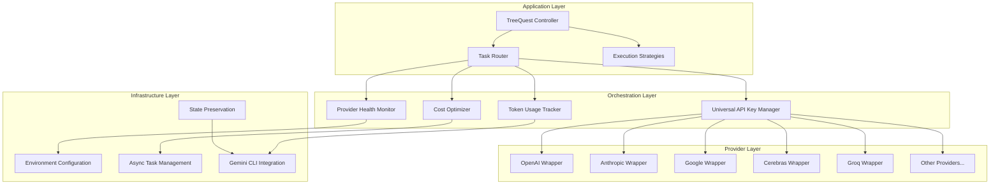

# 🏗️ Enhanced TreeQuest Architecture

## System Overview

Enhanced TreeQuest is a sophisticated multi-AI provider orchestration system built with modularity, scalability, and reliability at its core. The architecture follows a layered approach with clear separation of concerns.



## Core Components

### 1. Enhanced TreeQuest Controller (`enhanced_treequest_controller.py`)

The central orchestrator that coordinates all AI provider interactions.

**Key Features:**
- **Smart Provider Selection**: Automatically selects optimal providers based on task type
- **Parallel Execution**: Supports multiple execution strategies (fastest-first, consensus, cost-optimized)
- **Quality Scoring**: Evaluates response quality using multiple metrics
- **Automatic Fallback**: Seamlessly switches providers on failure

**Architecture Pattern:**
```python
class EnhancedTreeQuestController:
    def __init__(self):
        self.api_manager = APIKeyManager()
        self.providers = self._initialize_providers()
        self.task_router = TaskRouter(self.providers)
    
    async def execute_task(self, prompt: str, **kwargs) -> TaskResult:
        provider = self.task_router.select_optimal_provider(prompt, **kwargs)
        return await provider.execute(prompt)
```

### 2. Universal API Key Manager (`universal_api_key_manager.py`)

Manages API key discovery, validation, and configuration across all providers.

**Key Features:**
- **Multi-Location Discovery**: Searches multiple .env file locations
- **Health Monitoring**: Validates API key status and provider availability
- **Environment Configuration**: Automatically configures environment variables
- **Secure Storage**: Uses encrypted storage for sensitive keys

**Discovery Algorithm:**
```python
def discover_all_keys(self) -> Dict[str, str]:
    locations = [
        '.env',
        os.path.expanduser('~/.env'),
        '/Users/Subho/CascadeProjects/brain-spark-platform/.env',
        '/Users/Subho/CascadeProjects/multi-ai-treequest/.env'
    ]
    
    discovered_keys = {}
    for location in locations:
        keys = self._parse_env_file(location)
        discovered_keys.update(keys)
    
    return self._validate_keys(discovered_keys)
```

### 3. Token Usage Tracker (`token_usage_tracker.py`)

Monitors token usage in real-time with automatic orchestrator switching.

**Key Features:**
- **Real-Time Monitoring**: Tracks token consumption during execution
- **Threshold Detection**: Automatically detects when approaching 70% usage limit
- **Orchestrator Switching**: Seamlessly switches to Gemini CLI when needed
- **Session Management**: Maintains separate tracking for different sessions

**Monitoring Flow:**
```python
class TokenUsageTracker:
    def track_session(self, session_id: str):
        session = Session(session_id)
        session.start_tracking()
        
        if session.usage_percentage >= self.warning_threshold:
            self.trigger_orchestrator_switch()
        
        return session
```

### 4. Task-Specific Provider Routing

Intelligent routing system that selects optimal providers based on task characteristics.

**Routing Matrix:**
| Task Type | Primary Providers | Reasoning |
|-----------|------------------|-----------|
| `compilation_fixes` | cerebras, groq, openai | Speed and accuracy for code fixes |
| `ui_development` | openai, anthropic, together | UI/UX expertise and creativity |
| `database_fixes` | cerebras, groq, openai | Fast technical problem-solving |
| `ai_features` | openai, anthropic, together | Advanced AI capabilities |
| `research` | perplexity, google, openai | Research and fact-checking |
| `cost_sensitive` | together, groq, cerebras | Cost-effective solutions |

### 5. Parallel Execution Strategies

Multiple execution strategies optimized for different use cases.

#### Fastest-First Strategy
```python
async def fastest_first_execution(tasks: List[str]) -> List[TaskResult]:
    results = []
    for task in tasks:
        # Start all providers simultaneously
        provider_tasks = [provider.execute(task) for provider in self.providers]
        
        # Return first successful result
        result = await asyncio.race(provider_tasks)
        results.append(result)
    
    return results
```

#### Quality Consensus Strategy
```python
async def quality_consensus_execution(task: str) -> TaskResult:
    # Execute on multiple providers
    results = await asyncio.gather(*[
        provider.execute(task) for provider in self.top_providers
    ])
    
    # Select best result based on quality metrics
    return self._select_best_result(results)
```

#### Cost-Optimized Strategy
```python
async def cost_optimized_execution(task: str) -> TaskResult:
    # Sort providers by cost efficiency
    sorted_providers = self._sort_by_cost_efficiency(self.providers)
    
    # Try providers in order until success
    for provider in sorted_providers:
        try:
            return await provider.execute(task)
        except Exception:
            continue
```

## Provider Integration Architecture

### Provider Wrapper Pattern

Each AI provider is wrapped in a standardized interface:

```python
class ProviderWrapper:
    async def execute(self, prompt: str, **kwargs) -> TaskResult:
        # Standardized execution interface
        pass
    
    def estimate_cost(self, prompt: str) -> float:
        # Cost estimation
        pass
    
    def check_health(self) -> HealthStatus:
        # Health monitoring
        pass
```

### Provider-Specific Implementations

#### OpenAI Wrapper
```python
class OpenAIWrapper(ProviderWrapper):
    def __init__(self, api_key: str):
        self.client = openai.AsyncOpenAI(api_key=api_key)
    
    async def execute(self, prompt: str, **kwargs) -> TaskResult:
        response = await self.client.chat.completions.create(
            model=kwargs.get('model', 'gpt-4'),
            messages=[{'role': 'user', 'content': prompt}]
        )
        
        return TaskResult(
            content=response.choices[0].message.content,
            provider='openai',
            cost=self.calculate_cost(response.usage),
            quality_score=self.evaluate_quality(response)
        )
```

#### Cerebras Wrapper (Speed-Optimized)
```python
class CerebrasWrapper(ProviderWrapper):
    def __init__(self, api_key: str):
        self.client = cerebras.AsyncClient(api_key=api_key)
    
    async def execute(self, prompt: str, **kwargs) -> TaskResult:
        # Optimized for speed
        response = await self.client.completion.create(
            model='llama3.1-8b',  # Fast model
            prompt=prompt,
            max_tokens=kwargs.get('max_tokens', 1000),
            temperature=0.1  # Lower temperature for consistency
        )
        
        return TaskResult(
            content=response.choices[0].text,
            provider='cerebras',
            cost=self.calculate_cost(response),
            quality_score=self.evaluate_quality(response),
            execution_time=response.processing_time
        )
```

## State Management & Persistence

### Session State Preservation

```python
class StateManager:
    def __init__(self):
        self.sessions = {}
        self.state_storage = StateStorage()
    
    def preserve_state(self, session_id: str, state: Dict):
        """Preserve session state for orchestrator switching"""
        self.state_storage.save(session_id, {
            'context': state.get('context'),
            'history': state.get('history'),
            'preferences': state.get('preferences'),
            'token_usage': state.get('token_usage')
        })
    
    def restore_state(self, session_id: str) -> Dict:
        """Restore session state after orchestrator switch"""
        return self.state_storage.load(session_id)
```

### Gemini CLI Integration

```python
class GeminiCLIWrapper:
    def __init__(self):
        self.cli_path = self._find_gemini_binary()
        self.logger = self._setup_logging()
    
    async def execute_with_context(self, prompt: str, context: Dict) -> str:
        """Execute task with preserved context"""
        # Prepare context for Gemini CLI
        context_prompt = self._prepare_context(context)
        full_prompt = f"{context_prompt}\n\n{prompt}"
        
        # Execute via CLI
        result = await self._execute_cli_command(full_prompt)
        return result
    
    def _find_gemini_binary(self) -> str:
        """Locate Gemini CLI binary"""
        possible_paths = [
            '/usr/local/bin/gemini',
            '/opt/homebrew/bin/gemini',
            '/usr/bin/gemini'
        ]
        
        for path in possible_paths:
            if os.path.exists(path):
                return path
        
        raise RuntimeError("Gemini CLI not found")
```

## Quality Assessment System

### Multi-Metric Quality Evaluation

```python
class QualityAssessor:
    def evaluate_response(self, response: str, prompt: str) -> float:
        """Evaluate response quality using multiple metrics"""
        metrics = {
            'relevance': self._assess_relevance(response, prompt),
            'accuracy': self._assess_accuracy(response),
            'completeness': self._assess_completeness(response, prompt),
            'clarity': self._assess_clarity(response),
            'creativity': self._assess_creativity(response, prompt)
        }
        
        # Weighted average
        weights = {
            'relevance': 0.3,
            'accuracy': 0.25,
            'completeness': 0.2,
            'clarity': 0.15,
            'creativity': 0.1
        }
        
        return sum(metrics[key] * weights[key] for key in metrics)
```

## Error Handling & Resilience

### Circuit Breaker Pattern

```python
class CircuitBreaker:
    def __init__(self, failure_threshold: int = 3, timeout: int = 60):
        self.failure_threshold = failure_threshold
        self.timeout = timeout
        self.failure_count = 0
        self.last_failure_time = None
        self.state = 'CLOSED'  # CLOSED, OPEN, HALF_OPEN
    
    async def execute(self, func, *args, **kwargs):
        if self.state == 'OPEN':
            if time.time() - self.last_failure_time > self.timeout:
                self.state = 'HALF_OPEN'
            else:
                raise CircuitBreakerOpen("Circuit breaker is open")
        
        try:
            result = await func(*args, **kwargs)
            self.on_success()
            return result
        except Exception as e:
            self.on_failure()
            raise e
```

### Graceful Degradation

```python
class GracefulDegradation:
    def __init__(self, providers: List[ProviderWrapper]):
        self.providers = sorted(providers, key=lambda p: p.reliability_score, reverse=True)
    
    async def execute_with_fallback(self, prompt: str) -> TaskResult:
        """Execute with automatic fallback to backup providers"""
        errors = []
        
        for provider in self.providers:
            if provider.is_healthy():
                try:
                    return await provider.execute(prompt)
                except Exception as e:
                    errors.append((provider.name, str(e)))
                    continue
        
        # If all providers fail, return aggregated error
        raise AllProvidersFailedException(errors)
```

## Performance Optimization

### Async Task Management

```python
class AsyncTaskManager:
    def __init__(self, max_concurrent: int = 10):
        self.semaphore = asyncio.Semaphore(max_concurrent)
        self.task_queue = asyncio.Queue()
        self.result_cache = LRUCache(maxsize=1000)
    
    async def execute_batch(self, tasks: List[str]) -> List[TaskResult]:
        """Execute multiple tasks with concurrency control"""
        async def execute_single(task):
            async with self.semaphore:
                # Check cache first
                cache_key = self._generate_cache_key(task)
                if cache_key in self.result_cache:
                    return self.result_cache[cache_key]
                
                # Execute task
                result = await self._execute_task(task)
                
                # Cache result
                self.result_cache[cache_key] = result
                return result
        
        return await asyncio.gather(*[execute_single(task) for task in tasks])
```

### Caching Strategy

```python
class ResultCache:
    def __init__(self, ttl: int = 3600):  # 1 hour TTL
        self.cache = {}
        self.ttl = ttl
    
    def get(self, key: str) -> Optional[TaskResult]:
        """Get cached result if still valid"""
        if key in self.cache:
            result, timestamp = self.cache[key]
            if time.time() - timestamp < self.ttl:
                return result
            else:
                del self.cache[key]
        return None
    
    def set(self, key: str, result: TaskResult):
        """Cache result with timestamp"""
        self.cache[key] = (result, time.time())
```

## Security Considerations

### API Key Security

1. **Environment Variable Storage**: API keys stored in environment variables only
2. **No Hardcoding**: No API keys in source code or configuration files
3. **Secure Transmission**: All API communications over HTTPS
4. **Key Rotation**: Support for rotating API keys without downtime

### Request Sanitization

```python
class RequestSanitizer:
    def sanitize_prompt(self, prompt: str) -> str:
        """Sanitize user input to prevent injection attacks"""
        # Remove potentially dangerous content
        sanitized = self._remove_dangerous_patterns(prompt)
        
        # Validate input length
        if len(sanitized) > self.max_prompt_length:
            raise PromptTooLongException()
        
        return sanitized
    
    def _remove_dangerous_patterns(self, text: str) -> str:
        """Remove patterns that could be used for prompt injection"""
        dangerous_patterns = [
            r'ignore\s+previous\s+instructions',
            r'system\s*:\s*',
            r'<\s*script\s*>',
            # Add more patterns as needed
        ]
        
        for pattern in dangerous_patterns:
            text = re.sub(pattern, '', text, flags=re.IGNORECASE)
        
        return text
```

## Monitoring & Observability

### Metrics Collection

```python
class MetricsCollector:
    def __init__(self):
        self.metrics = {
            'requests_total': 0,
            'requests_successful': 0,
            'requests_failed': 0,
            'average_response_time': 0,
            'provider_usage': defaultdict(int),
            'cost_total': 0
        }
    
    def record_request(self, provider: str, success: bool, response_time: float, cost: float):
        """Record metrics for a request"""
        self.metrics['requests_total'] += 1
        self.metrics['provider_usage'][provider] += 1
        self.metrics['cost_total'] += cost
        
        if success:
            self.metrics['requests_successful'] += 1
        else:
            self.metrics['requests_failed'] += 1
        
        # Update average response time
        self._update_average_response_time(response_time)
```

## Future Architecture Considerations

### Planned Enhancements

1. **Plugin System**: Support for custom provider plugins
2. **Advanced Caching**: Redis-based distributed caching
3. **Load Balancing**: Intelligent load distribution across providers
4. **Machine Learning**: ML-based provider selection optimization
5. **Real-time Analytics**: Live dashboard for monitoring and analytics

### Scalability Roadmap

1. **Horizontal Scaling**: Multi-instance deployment support
2. **Microservices Architecture**: Break down into smaller services
3. **Event-Driven Architecture**: Async event processing
4. **Cloud-Native**: Kubernetes deployment and orchestration
5. **Global Distribution**: Multi-region provider deployment

---

This architecture provides a solid foundation for a production-ready multi-AI orchestration system with enterprise-grade reliability, security, and performance characteristics.